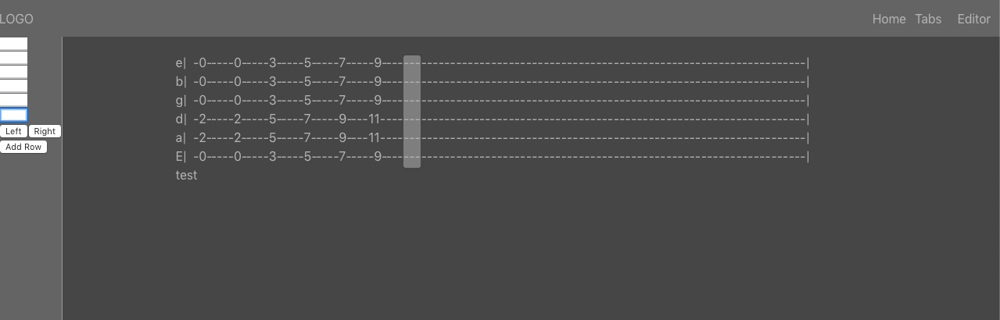

# Tabber
Tabber is an application for transcribing Guitar tabulature into ASCII format. It is currently in early development.
The goal is to ease the pain of making ASCII format tabs so you can focus on writing music. And unlike some popular tools,
you tabs can be used anywhere that supports a text file.
# current build  
Tabber is currently in a proof of concept stage. The barebones interface of the editor is in place, but there is a lot to
be done before its a smooth experience.
In its current state, you can build tabulature navigating column by column with either the mouse, or the keyboard.
The goal was to make navigation easy and eliminate the need to fill blank spcae as you normally would when building guitar tabs.
Left and right will navigate through the columns, down will navigate the string inputs.  
# Future Updates
- Add chord autofill and chord suggestion dropdowns: 
  - These will likely be in the control panel section, but I would like to add them to the right-cick menu as well.
- export: 
  - User will be able to export current project as a text file. 
- Improved lyrics and notes feature:
  - There will be some imporvements in the subtitle sections. Ideally you will be able to more easily place text underneath the notes
  they associate with.
# Known issues: 
- Navigating back to a previous row is currently not possible. This bug was introduced with the newest feature.  
Priority: High
# Photos

